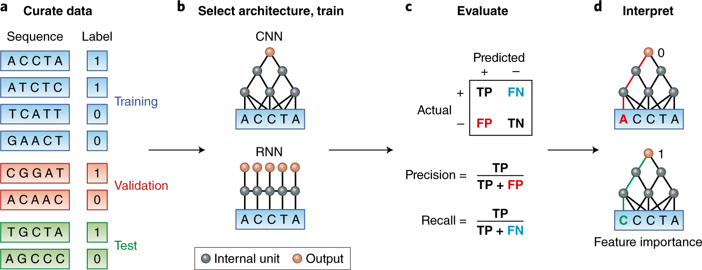
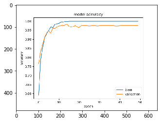
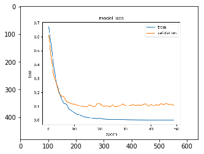
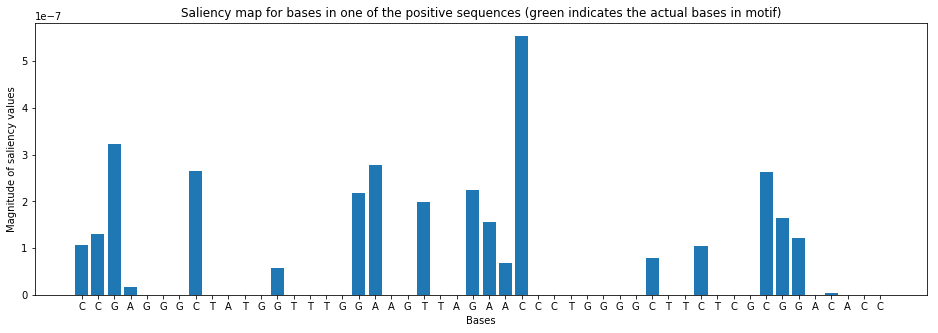
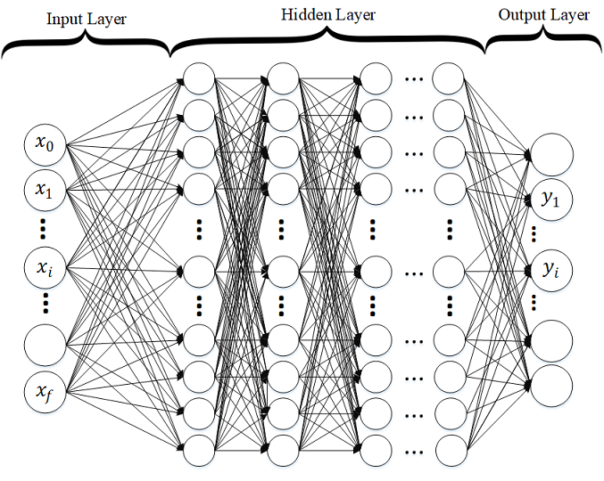

# An example neural network program to identify protein binding patterns

Source: A Primer on Deep Learning in Genomics - Public

## The up front package imports

	import argparse
	#import input_data
	import os
	import sys
	import tensorflow 
	#import time
	import numpy as np
	from sklearn.preprocessing import LabelEncoder, OneHotEncoder
	from sklearn.model_selection import train_test_split

	import keras
	from keras.models import Sequential
	from keras import layers
	from keras.layers import Conv1D, Dense, MaxPooling1D, Flatten
	        

## The mainline routine

def main():

##  Parameters that drive the program. 

<ul>
<li>Where to find our input  
<li>Where to put the output.
<li>Settable hyperparameters
</ul>
	
	
    parser = argparse.ArgumentParser()

    # environment variable when name starts with $
    parser.add_argument('--data_dir', type=str, default='$DATA_DIR',help='Directory with data')
    parser.add_argument('--result_dir', type=str, default='$RESULT_DIR',help='Directory with results')
    parser.add_argument('--sequences_file', type=str,default='sequences.txt',help='File name for sequences')
    parser.add_argument('--labels_file', type=str,default='labels.txt',help='File name for labels')

    FLAGS, unparsed = parser.parse_known_args()

    print (FLAGS.result_dir)

    if (FLAGS.result_dir[0] == '$'):
        RESULT_DIR = os.environ[FLAGS.result_dir[1:]]
    else:
        RESULT_DIR = FLAGS.result_dir
        os.environ['RESULT_DIR']=FLAGS.result_dir

    if (FLAGS.data_dir[0] == '$'):
        DATA_DIR = os.environ[FLAGS.data_dir[1:]]
    else:
        DATA_DIR = FLAGS.data_dir
        os.environ['DATA_DIR']=FLAGS.data_dir

    # Add data dir to file path
    sequences_file = os.path.join(DATA_DIR, FLAGS.sequences_file)
    
    labels_file = os.path.join(DATA_DIR, FLAGS.labels_file)
    

#  "One-hot" encode the input data (Common practice for handling categorical data in numeric models )     
    
    with open(sequences_file,'r') as file: 
        raw_sequences=file.read()

    sequences=raw_sequences.split('\n')

    sequences = list(filter(None, sequences))  # This removes empty sequences.

    # The LabelEncoder encodes a sequence of bases as a sequence of integers.
    integer_encoder = LabelEncoder()  
    # The OneHotEncoder converts an array of integers to a sparse matrix where 
    # each row corresponds to one possible value of each feature.
    
    one_hot_encoder = OneHotEncoder(categories='auto')   
    input_features = []

    for sequence in sequences:
        integer_encoded = integer_encoder.fit_transform(list(sequence))
        integer_encoded = np.array(integer_encoded).reshape(-1, 1)
        one_hot_encoded = one_hot_encoder.fit_transform(integer_encoded)
        input_features.append(one_hot_encoded.toarray())

    np.set_printoptions(threshold=40)
    input_features = np.stack(input_features)
 

    with open(labels_file,'r') as file: 
        raw_labels=file.read()

    labels=raw_labels.split('\n')

    labels = list(filter(None, labels))  # This removes empty sequences.

    one_hot_encoder = OneHotEncoder(categories='auto')
    labels = np.array(labels).reshape(-1, 1)
    input_labels = one_hot_encoder.fit_transform(labels).toarray()
   
##  A sample of the encoded data is written to the log.

    
    print("Example sequence\n-----------------------")
    print('DNA Sequence #1:\n',sequences[0][:10],'...',sequences[0][-10:])
    print('One hot encoding of Sequence #1:\n',input_features[0].T)

    print('Labels:\n',labels.T)
    print('One-hot encoded labels:\n',input_labels.T)

    Using TensorFlow backend.
    
    Example gene sequence represetation
    -----------------------
    DNA Sequence #1:
     CCGAGGGCTA ... CGCGGACACC
     
    One hot encoding of Sequence #1:
     [[0. 0. 0. ... 1. 0. 0.]
     [1. 1. 0. ... 0. 1. 1.]
     [0. 0. 1. ... 0. 0. 0.]
     [0. 0. 0. ... 0. 0. 0.]]
     
    Labels:
     [['0' '0' '0' ... '0' '1' '1']]
     
    One-hot encoded labels:
     [[1. 1. 1. ... 1. 0. 0.]
     [0. 0. 0. ... 0. 1. 1.]]

# Standard practice is to split the input data into training, test, and validation sets

    train_features, test_features, train_labels, test_labels = train_test_split(
        input_features, input_labels, test_size=0.25, random_state=42)

# The neural network model definition

    model = Sequential()
    model.add(Conv1D(filters=32, kernel_size=12, 
                 input_shape=(train_features.shape[1], 4)))
    model.add(MaxPooling1D(pool_size=4))
    model.add(Flatten())
    model.add(Dense(16, activation='relu'))
    model.add(Dense(2, activation='softmax'))

    model.compile(loss='binary_crossentropy', optimizer='adam', metrics=['binary_accuracy'])
    model.summary()

# The training step

    history = model.fit(train_features, train_labels, epochs=50, verbose=0, validation_split=0.25)

# Training phase outputs are saved to the RESULTS location
    
    output_model_folder = os.environ["RESULT_DIR"]
    
### The trained model 

 	h5_filename  = "bioinformatics_model.h5"
      print("h5_filename: ",h5_filename)

    model.save( h5_filename ) 
    cmdstring1 = 'cp ' + h5_filename + ' '+  output_model_folder
    os.system(cmdstring1)

### A compressed version of the trained modelfile (required by WML for deploying Keras models)

    tar_filename = "bioinformatics_model.tgz"

    cmdstring2 = 'tar -zcvf ' + tar_filename + ' ' + h5_filename
    os.system(cmdstring2)
    
    print("tar_filename: ",tar_filename)
    
    cmdstring22 = 'cp ' + tar_filename + ' '+  output_model_folder
    os.system(cmdstring22)
    
    #os.system('(cd $RESULT_DIR/model;tar cvfz ../saved_model.tar.gz .)')
    # serialize model to JSON

 
### A reusable representation of our model definition   

    model_json = model.to_json()
    with open("bioinformatics_model.json", "w") as json_file:
        json_file.write(model_json)
 
    cmdstring3 = 'cp ' + "bioinformatics_model.json" + ' '+  output_model_folder
    os.system(cmdstring3)

### The trained parameters i.e., the weights of our model

    model.save_weights("bioinformatics_model_weights.h5")
    cmdstring4 = 'cp ' + "bioinformatics_model_weights.h5" + ' '+  output_model_folder
    os.system(cmdstring4)

## A table depicting the neural network topology

    Model: "sequential_1"
    _________________________________________________________________
    Layer (type)                 Output Shape              Param #   
    =================================================================
    conv1d_1 (Conv1D)            (None, 39, 32)            1568      
    _________________________________________________________________
    max_pooling1d_1 (MaxPooling1 (None, 9, 32)             0         
    _________________________________________________________________
    flatten_1 (Flatten)          (None, 288)               0         
    _________________________________________________________________
    dense_1 (Dense)              (None, 16)                4624      
    _________________________________________________________________
    dense_2 (Dense)              (None, 2)                 34        
    =================================================================
    Total params: 6,226
    Trainable params: 6,226
    Non-trainable params: 0
    _________________________________________________________________
 
## Accuracy Metric
 
    binary_accuracy: 98.40%
    
    
## Accuracy Plot

## Loss Plot

## Confusion Matrix

 
## The RESULTS folder contents  
   
    -rw-r-----. 1 wsuser watsonstudio 108728 Feb 25 19:58 bioinformatics_model.h5
    -rw-r-----. 1 wsuser watsonstudio   1988 Feb 25 19:58 bioinformatics_model.json
    -rw-r-----. 1 wsuser watsonstudio  70710 Feb 25 19:58 bioinformatics_model.tgz
    -rw-r-----. 1 wsuser watsonstudio  12737 Feb 25 19:58 bioinformatics_model_accuracy.pdf
    -rw-r-----. 1 wsuser watsonstudio  25045 Feb 25 19:58 bioinformatics_model_accuracy.png
    -rw-r-----. 1 wsuser watsonstudio  23752 Feb 25 19:58 bioinformatics_model_confusion_matrix.png
    -rw-r-----. 1 wsuser watsonstudio  11810 Feb 25 19:58 bioinformatics_model_loss.pdf
    -rw-r-----. 1 wsuser watsonstudio  25582 Feb 25 19:58 bioinformatics_model_loss.png
    -rw-r-----. 1 wsuser watsonstudio   1036 Feb 25 19:58 bioinformatics_model_scoring.txt
    -rw-r-----. 1 wsuser watsonstudio  42168 Feb 25 19:58 bioinformatics_model_weights.h5
 
# Training phase outputs obtainable from RESULTS location are subsequently used to make inferences

## Saliency Graph and binding prediction

    Known motif: CGACCGAACTCC
    Sequence: GATACCCCCCCCACCCCCCCTCCCCCCCCCCCCCCCCCCGACCGAACTCC

    No-bind probability: 2.4192843284254195e-06 Bind probability: 0.999997615814209        
    
## Thus far, everything can potentially run anywhere e.g., on a laptop or a local cluster. 

But, 
- Bioinformatic data can be very large.
- The models can be very large and computationally complex.

