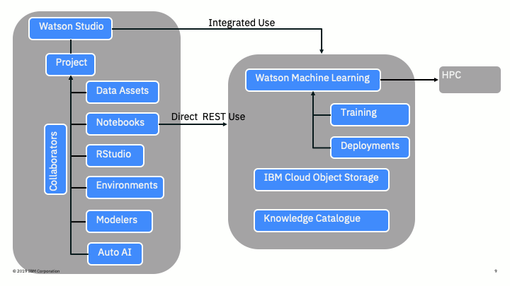
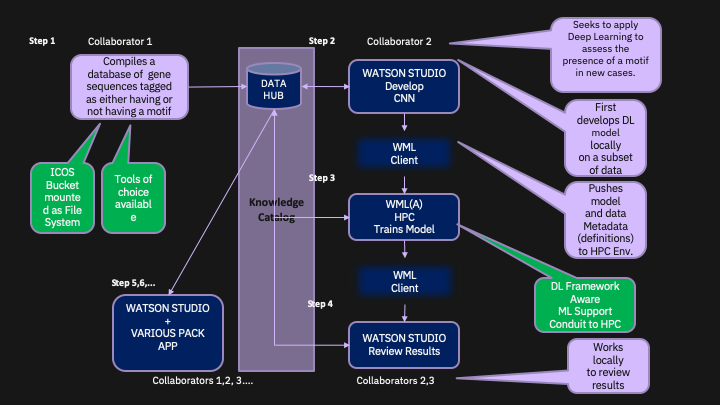

# Bioinformatics Modeling Using Watson Machine Learning


```python

from project_lib import Project
project = Project.access()
storage_credentials = project.get_storage_metadata()

```

### Preliminary:  Instantiate a Watson Studio project , WML, ICOS (done outside of this notebook)

### WML Client Version 1.0378 setup for demo purposes


```python
import sys, os, imp
sys.path.reverse()
from watson_machine_learning_client import WatsonMachineLearningAPIClient
sys.path.reverse()
print("Done")
```

    Done


## Connect to Watson Machine Learning

Note: These credentials are unhidden for demo purposes.


```python
wml_credentials = {
  "apikey": "AvtF6zGC6YD2FHWiB9viJTFtzTbBZecyPzAYzh0Q6ISy",
  "iam_apikey_description": "Auto-generated for key fc7e3c6e-98a2-4f10-81c4-edcb67ab5ba4",
  "iam_apikey_name": "Service credentials-1",
  "iam_role_crn": "crn:v1:bluemix:public:iam::::serviceRole:Writer",
  "iam_serviceid_crn": "crn:v1:bluemix:public:iam-identity::a/c095a1d4738948bf43a84feb693c0d52::serviceid:ServiceId-989b8f81-f13f-4ca0-a2a3-3f71a1b51db7",
  "instance_id": "615a5483-2072-4c9d-8d76-3fed527c6b59",
  "url": "https://us-south.ml.cloud.ibm.com"
}

client = WatsonMachineLearningAPIClient(wml_credentials)

print('client.version:', client.version)
```

    client.version: 1.0.378


## Connect to IBM Cloud Object Storage and define search script


```python
icos_credentials={
  "apikey": "uSYOgQRcMVikimnEwccgQcNW7xwp-ckXyB-8H-qhb2u-",
  "cos_hmac_keys": {
    "access_key_id": "7b602b4cefa5483e8ee7d731e3275c52",
    "secret_access_key": "3ac90cff6372194eb258b07f761bea92b7b1740923d3ad9e"
  },
  "endpoints": "https://control.cloud-object-storage.cloud.ibm.com/v2/endpoints",
  "iam_apikey_description": "Auto-generated for key 7b602b4c-efa5-483e-8ee7-d731e3275c52",
  "iam_apikey_name": "HIMSS2020-Credential",
  "iam_role_crn": "crn:v1:bluemix:public:iam::::serviceRole:Writer",
  "iam_serviceid_crn": "crn:v1:bluemix:public:iam-identity::a/c095a1d4738948bf43a84feb693c0d52::serviceid:ServiceId-24edfd07-f9ab-46f0-be92-d8203b252328",
  "resource_instance_id": "crn:v1:bluemix:public:cloud-object-storage:global:a/c095a1d4738948bf43a84feb693c0d52:b342a808-6323-46bd-844b-e01bc0671f9b::"
}

import ibm_boto3
from ibm_botocore.client import Config, ClientError
from datetime import datetime
import time


# Constants for IBM COS values
COS_ENDPOINT = "https://s3.us.cloud-object-storage.appdomain.cloud" # Current list avaiable at https://control.cloud-object-storage.cloud.ibm.com/v2/endpoints
COS_API_KEY_ID = icos_credentials["apikey"] # eg "W00YiRnLW4a3fTjMB-odB-2ySfTrFBIQQWanc--P3byk"
COS_AUTH_ENDPOINT = 'https://iam.bluemix.net/oidc/token'
COS_RESOURCE_CRN = icos_credentials["resource_instance_id"]

training_bucket = 'hmss2020-training'
results_bucket  = 'hmss2020-results'

# Create resource
cos = ibm_boto3.resource("s3",
    ibm_api_key_id=COS_API_KEY_ID,
    ibm_service_instance_id=COS_RESOURCE_CRN,
    ibm_auth_endpoint=COS_AUTH_ENDPOINT,
    config=Config(signature_version="oauth"),
    endpoint_url=COS_ENDPOINT
)
cos_client = ibm_boto3.client("s3",
    ibm_api_key_id=COS_API_KEY_ID,
    ibm_service_instance_id=COS_RESOURCE_CRN,
    ibm_auth_endpoint=COS_AUTH_ENDPOINT,
    config=Config(signature_version="oauth"),
    endpoint_url=COS_ENDPOINT
)
def get_download_list(bucket_name,model_location,cos=cos):
    
    print("Retrieving relevant bucket contents from: {} Model_location: {}\n".format(bucket_name,model_location)) 
    download_list=[]
    try:
        files = cos.Bucket(bucket_name).objects.all()
        for file in files: 
            item=file.key.split('/')
            if 'bioinformatics' in item[1] and model_location in item[0]:
                print(file.key)
                download_list.append(file.key)
                fn=file.key.split('/')[1]
                cos_client.download_file('hmss2020-results',Key=file.key,Filename=fn)
                     
    except ClientError as be:
        print("CLIENT ERROR: {0}\n".format(be))
    except Exception as e:
        print("Unable to retrieve bucket contents: {0}".format(e))
    return download_list  
```

##  A zip file  is used to convey our machine learning model program artifacts to WML.

### Example 1:  Obtain zip file from project asset storage


```python
!cp /project_data/data_asset/tf_model_v5.zip .
```

### Example 2: Obtain zip file from git hub
import os
import wget
filename = 'tf_model_v5.zip'

#url= 'https://github.com/fjgreco/himss2020/blob/master/tf_model_v5.zip?raw=true'

url= 'https://github.com/fjgreco/Bioinformatics/blob/master/tf_model_v5.zip?raw=true'

if not os.path.isfile( filename ):
    print("File {} not found, Downloading from {}".format(filename,url))
    wget.download(url)
## Setup a  WML training run

### Specify training run parameters

#### Note: The bucket names and endpoint URLs of the buckets were created in the preliminary ICOS step


```python
#V3
metadata = {
client.repository.DefinitionMetaNames.NAME              : "zen-bioinformatics-training-definition_v5",
client.repository.DefinitionMetaNames.FRAMEWORK_NAME    : "tensorflow",
client.repository.DefinitionMetaNames.FRAMEWORK_VERSION : "1.14",
client.repository.DefinitionMetaNames.RUNTIME_NAME      : "python",
client.repository.DefinitionMetaNames.RUNTIME_VERSION   : "3.6",
client.repository.DefinitionMetaNames.EXECUTION_COMMAND : "python3 tf_model_v5/neural_network_v5.py --sequencesFile ${DATA_DIR}/sequences.txt --labelsFile ${DATA_DIR}/labels.txt" 
}
definition_details = client.repository.store_definition( "tf_model_v5.zip", meta_props=metadata )
definition_uid     = client.repository.get_definition_uid( definition_details )
print( "definition_uid: ", definition_uid )
```

    definition_uid:  93b2f1c3-3a6a-40d7-a12b-40c747d10d43


### The following code identifies the IBM Cloud Object Storage buckets where our input training data resides and where our results will end up. 
### We also indicate the hardware platform on which we want to run, in this case K80.


```python
icos_metadata = {
client.training.ConfigurationMetaNames.NAME         : "zen-bioinformatics-training-run_v5",
client.training.ConfigurationMetaNames.TRAINING_DATA_REFERENCE : {
   "connection" : { 
      "endpoint_url"      : "https://s3.us.cloud-object-storage.appdomain.cloud",
      "access_key_id"     : "7d6ca104f1fb4ff88bd8ad9ec7bdd090",
      "secret_access_key" : "f89db50acd602219b4e5aa443cca7b2ca8f949ad0ca927ed"
      },
   "source" : { 
      "bucket" : "hmss2020-training",
      },
      "type" : "s3"
   },
client.training.ConfigurationMetaNames.TRAINING_RESULTS_REFERENCE: {
   "connection" : {
      "endpoint_url"      : "https://s3.us.cloud-object-storage.appdomain.cloud",
      "access_key_id"     : "7d6ca104f1fb4ff88bd8ad9ec7bdd090",
      "secret_access_key" : "f89db50acd602219b4e5aa443cca7b2ca8f949ad0ca927ed"
      },
      "target" : {
         "bucket" : "hmss2020-results",
      },
      "type" : "s3"
   }
}
print('Done')
```

## Start and monitor training progress


```python
run_details = client.training.run(definition_uid, meta_props=icos_metadata)
run_uid     = client.training.get_run_uid(run_details)
print("run_uid: ", run_uid)
```

    run_uid:  model-5q4550d1


```python
from time import sleep

cts=client.training.get_details(run_uid)['entity']['status']['state']

while cts not in ['completed', 'failed', 'canceled', 'error']:
    print(cts)
    sleep(10)
    cts=client.training.get_status(run_uid)['state']
    
print( cts)
```

    pending
    pending
    pending
    running
    running
    running
	...
    running
    running
    running
    running
    completed


## Review Results

### Once our run completes, we check run details...


```python
client.training.get_details(run_uid)
```


    {'entity': {'model_definition': {'definition_href': 'https://us-south.ml.cloud.ibm.com/v3/ml_assets/training_definitions/9b538378-9981-403c-8b6e-4245cf9d4a52',
       'execution': {'command': 'python3 tf_model_v5/neural_network_v5.py --sequencesFile ${DATA_DIR}/sequences.txt --labelsFile ${DATA_DIR}/labels.txt',
        'compute_configuration': {'name': 'k80'}},
       'framework': {'name': 'tensorflow', 'version': '1.14'},
       'name': 'zen-bioinformatics-training-run_v5'},
      'status': {'current_at': '2020-02-25T19:58:47.090Z',
       'finished_at': '2020-02-25T19:57:51.084Z',
       'message': 'training-u_33PzlWR: ',
       'metrics': [],
       'running_at': '2020-02-25T19:55:52.023Z',
       'state': 'completed',
       'submitted_at': '2020-02-25T19:55:41.317Z'},
      'training_data_reference': {'connection': {'access_key_id': '7d6ca104f1fb4ff88bd8ad9ec7bdd090',
        'endpoint_url': 'https://s3.us.cloud-object-storage.appdomain.cloud',
        'secret_access_key': 'f89db50acd602219b4e5aa443cca7b2ca8f949ad0ca927ed'},
       'location': {'bucket': 'hmss2020-training'},
       'type': 's3'},
      'training_results_reference': {'connection': {'access_key_id': '7d6ca104f1fb4ff88bd8ad9ec7bdd090',
        'endpoint_url': 'https://s3.us.cloud-object-storage.appdomain.cloud',
        'secret_access_key': 'f89db50acd602219b4e5aa443cca7b2ca8f949ad0ca927ed'},
       'location': {'bucket': 'hmss2020-results',
        'model_location': 'training-u_33PzlWR'},
       'type': 's3'}},
     'metadata': {'created_at': '2020-02-25T19:55:39.215Z',
      'guid': 'model-5q4550d1',
      'modified_at': '2020-02-25T19:55:39.215Z',
      'url': '/v3/models/model-5q4550d1'}}


```python
ctd=client.training.get_details(run_uid)
model_location= ctd['entity']['training_results_reference']['location']['model_location'] 
```

### Download training results from shared object storage to our local project  environment. 
### We are using Watson Studio running on Cloud Pak for Data.


```python
  dl2=get_download_list(results_bucket,model_location)
```

    Retrieving relevant bucket contents from: hmss2020-results Model_location: training-u_33PzlWR
    
    training-u_33PzlWR/bioinformatics_model.h5
    training-u_33PzlWR/bioinformatics_model.json
    training-u_33PzlWR/bioinformatics_model.tgz
    training-u_33PzlWR/bioinformatics_model_accuracy.pdf
    training-u_33PzlWR/bioinformatics_model_accuracy.png
    training-u_33PzlWR/bioinformatics_model_confusion_matrix.png
    training-u_33PzlWR/bioinformatics_model_loss.pdf
    training-u_33PzlWR/bioinformatics_model_loss.png
    training-u_33PzlWR/bioinformatics_model_scoring.txt
    training-u_33PzlWR/bioinformatics_model_weights.h5


```python
import matplotlib.pyplot as plt
import matplotlib.image as mpimg
```

```python
image = mpimg.imread("bioinformatics_model_accuracy.png")
plt.imshow(image)
plt.show()
```


```python
image = mpimg.imread("bioinformatics_model_loss.png")
plt.imshow(image)
plt.show()
```


```python
image = mpimg.imread("bioinformatics_model_confusion_matrix.png")
plt.imshow(image)
plt.show()
```


```python
!cat bioinformatics_model_scoring.txt
```

    Model: "sequential"
    _________________________________________________________________
    Layer (type)                 Output Shape              Param #   
    =================================================================
    conv1d (Conv1D)              (None, 39, 32)            1568      
    _________________________________________________________________
    max_pooling1d (MaxPooling1D) (None, 9, 32)             0         
    _________________________________________________________________
    flatten (Flatten)            (None, 288)               0         
    _________________________________________________________________
    dense (Dense)                (None, 16)                4624      
    _________________________________________________________________
    dense_1 (Dense)              (None, 2)                 34        
    =================================================================
    Total params: 6,226
    Trainable params: 6,226
    Non-trainable params: 0
    _________________________________________________________________
    binary_accuracy: 98.40%


### Run Clean-up
client.training.cancel(run_uid)client.training.delete(run_uid)
## SOME TIME LATER...

### Using  the stored model definition and trained weights, we can recompile the model and continue to work with it.

### * Include screen shot of object storage/catalog


```python
mh5="bioinformatics_model.h5"
mjson="bioinformatics_model.json"
mtgz="bioinformatics_model.tgz"
mweights="bioinformatics_model_weights.h5"
mconfusion="bioinformatics_model_confusion_matrix.png"

!ls -al bioinformatics*
```

    -rw-r-----. 1 wsuser watsonstudio 108728 Feb 25 19:58 bioinformatics_model.h5
    -rw-r-----. 1 wsuser watsonstudio   1988 Feb 25 19:58 bioinformatics_model.json
    -rw-r-----. 1 wsuser watsonstudio  70710 Feb 25 19:58 bioinformatics_model.tgz
    -rw-r-----. 1 wsuser watsonstudio  12737 Feb 25 19:58 bioinformatics_model_accuracy.pdf
    -rw-r-----. 1 wsuser watsonstudio  25045 Feb 25 19:58 bioinformatics_model_accuracy.png
    -rw-r-----. 1 wsuser watsonstudio  23752 Feb 25 19:58 bioinformatics_model_confusion_matrix.png
    -rw-r-----. 1 wsuser watsonstudio  11810 Feb 25 19:58 bioinformatics_model_loss.pdf
    -rw-r-----. 1 wsuser watsonstudio  25582 Feb 25 19:58 bioinformatics_model_loss.png
    -rw-r-----. 1 wsuser watsonstudio   1036 Feb 25 19:58 bioinformatics_model_scoring.txt
    -rw-r-----. 1 wsuser watsonstudio  42168 Feb 25 19:58 bioinformatics_model_weights.h5


### Re-compile neural model for local use
This step does not involve training data.


```python
from tensorflow.keras.models import model_from_json
# load json and create model
with open(mjson, 'r') as json_file:
    loaded_model_json = json_file.read()
    
loaded_model = model_from_json(loaded_model_json)

# load weights into new model
loaded_model.load_weights(mweights)
print("Loaded model from disk")
 
# evaluate loaded model on test data
loaded_model.compile(loss='binary_crossentropy', optimizer='rmsprop', metrics=['accuracy'])
```

    Loaded model from disk


## Gather some data for analysis 


```python
from sklearn.preprocessing import LabelEncoder, OneHotEncoder
from sklearn.model_selection import train_test_split
import numpy as np

def ohe_Xy(sequences,labels):
    sequences_file=sequences

    labels_file=labels
    
    with open(sequences_file,'r') as file: 
        raw_sequences=file.read()

    sequences=raw_sequences.split('\n')

    sequences = list(filter(None, sequences))  # This removes empty sequences.


    # The LabelEncoder encodes a sequence of bases as a sequence of integers.
    integer_encoder = LabelEncoder()  
    # The OneHotEncoder converts an array of integers to a sparse matrix where 
    # each row corresponds to one possible value of each feature.
    one_hot_encoder = OneHotEncoder(categories='auto')   
    input_features = []

    for sequence in sequences:
        integer_encoded = integer_encoder.fit_transform(list(sequence))
        integer_encoded = np.array(integer_encoded).reshape(-1, 1)
        one_hot_encoded = one_hot_encoder.fit_transform(integer_encoded)
        input_features.append(one_hot_encoded.toarray())

    np.set_printoptions(threshold=40)
    input_features = np.stack(input_features)
    print("One hot encoding of features and labels\n-----------------------")
    print('\nDNA Sequence #1:\n',sequences[0][:10],'...',sequences[0][-10:])
    print('\nOne hot encoding of Sequence #1:\n',input_features[0].T)


    with open(labels_file,'r') as file: 
            raw_labels=file.read()

    labels=raw_labels.split('\n')

    labels = list(filter(None, labels))  # This removes empty sequences.

    one_hot_encoder = OneHotEncoder(categories='auto')
    labels = np.array(labels).reshape(-1, 1)
    input_labels = one_hot_encoder.fit_transform(labels).toarray()

    print('\nLabels:\n',labels.T)
    print('\nOne-hot encoded labels:\n',input_labels.T)
    
    return input_features, input_labels, sequences

    
def split_input_data(input_features,sequences):
    print("\nSplitting input data into train and test segments...")
    train_features, test_features, train_labels, test_labels = train_test_split(
        input_features, input_labels, test_size=0.25, random_state=42)
    return test_features, test_labels, train_features, train_labels


input_features, input_labels, sequences = ohe_Xy('/project_data/data_asset/DATADIR/sequences.txt','/project_data/data_asset/DATADIR/labels.txt')

X,Y,_,_= split_input_data(input_features,input_labels)

print('Done')
```

    One hot encoding of features and labels
    -----------------------
    
    DNA Sequence #1:
     CCGAGGGCTA ... CGCGGACACC
    
    One hot encoding of Sequence #1:
     [[0. 0. 0. ... 1. 0. 0.]
     [1. 1. 0. ... 0. 1. 1.]
     [0. 0. 1. ... 0. 0. 0.]
     [0. 0. 0. ... 0. 0. 0.]]
    
    Labels:
     [['0' '0' '0' ... '0' '1' '1']]
    
    One-hot encoded labels:
     [[1. 1. 1. ... 1. 0. 0.]
     [0. 0. 0. ... 0. 1. 1.]]
    
    Splitting input data into train and test segments...
    Done


### Score model using this data


```python
score = loaded_model.evaluate(X, Y, verbose=0)
print("%s: %.2f%%" % (loaded_model.metrics_names[1], score[1]*100))
```

    acc: 98.40%


## Further analysis...


```python
test_features=X
test_labels=Y
```


```python
import matplotlib.pyplot as plt
from sklearn.metrics import confusion_matrix
import itertools

predicted_labels = loaded_model.predict(np.stack(test_features))
cm = confusion_matrix(np.argmax(test_labels, axis=1), 
                      np.argmax(predicted_labels, axis=1))
print('Confusion matrix:\n',cm)

cm = cm.astype('float') / cm.sum(axis = 1)[:, np.newaxis]

plt.imshow(cm, cmap=plt.cm.Blues)
plt.title('Normalized confusion matrix')
plt.colorbar()
plt.xlabel('True label')
plt.ylabel('Predicted label')
plt.xticks([0, 1]); plt.yticks([0, 1])
plt.grid('off')
for i, j in itertools.product(range(cm.shape[0]), range(cm.shape[1])):
    plt.text(j, i, format(cm[i, j], '.2f'),
             horizontalalignment='center',
             color='white' if cm[i, j] > 0.5 else 'black')
```

    Confusion matrix:
     [[252   7]
     [  2 239]]


```python
import tensorflow.keras.backend as K

def compute_salient_bases(model, x):
  input_tensors = [loaded_model.input]
  gradients = model.optimizer.get_gradients(model.output[0][1], model.input)
  compute_gradients = K.function(inputs = input_tensors, outputs = gradients)
  
  x_value = np.expand_dims(x, axis=0)
  gradients = compute_gradients([x_value])[0][0]
  sal = np.clip(np.sum(np.multiply(gradients,x), axis=1),a_min=0, a_max=None)
  return sal
```


```python
sequences2=['GATACCCCCCCCACCCCCCCTCCCCCCCCCCCCCCCCCCGACCGAACTCC',
            'GACCCCCCCCCCCCCTCCACCCCACCCCCCCCCCCCTCCCCCCCCCCCCC',
           'GACCCCCCCCCCCCCTCCACCCCACCCCCCCCCCCCTCCCCCCCCCCCCC']
```


```python
from sklearn.preprocessing import LabelEncoder, OneHotEncoder
# The LabelEncoder encodes a sequence of bases as a sequence of integers.
integer_encoder = LabelEncoder()  
# The OneHotEncoder converts an array of integers to a sparse matrix where 
# each row corresponds to one possible value of each feature.
one_hot_encoder = OneHotEncoder(categories='auto')  

input_features2 = []
for sequence2 in sequences2:
    print(sequence2)
    integer_encoded2 = integer_encoder.fit_transform(list(sequence2))
    integer_encoded2 = np.array(integer_encoded2).reshape(-1, 1)
    one_hot_encoded2 = one_hot_encoder.fit_transform(integer_encoded2)
    input_features2.append(one_hot_encoded2.toarray())

np.set_printoptions(threshold=40)
input_features2 = np.stack(input_features2)
print("Example nucleotide sequence\n-----------------------")
print('DNA Sequence2 #1:\n',sequences2[0][:10],'...',sequences2[0][-10:])
print('One hot encoding of Sequence2 #1:\n',input_features2[0].T)
```

    GATACCCCCCCCACCCCCCCTCCCCCCCCCCCCCCCCCCGACCGAACTCC
    GACCCCCCCCCCCCCTCCACCCCACCCCCCCCCCCCTCCCCCCCCCCCCC
    GACCCCCCCCCCCCCTCCACCCCACCCCCCCCCCCCTCCCCCCCCCCCCC
    Example nucleotide sequence
    -----------------------
    DNA Sequence2 #1:
     GATACCCCCC ... ACCGAACTCC
    One hot encoding of Sequence2 #1:
     [[0. 1. 0. ... 0. 0. 0.]
     [0. 0. 0. ... 0. 1. 1.]
     [1. 0. 0. ... 0. 0. 0.]
     [0. 0. 1. ... 1. 0. 0.]]


```python
prediction2=loaded_model.predict(input_features2)
```


```python
def saliency2(model,sequence_index,motif_start):
    sal = compute_salient_bases(model, input_features2[sequence_index])

    plt.figure(figsize=[16,5])
    barlist = plt.bar(np.arange(len(sal)), sal)
    #[barlist[i].set_color('C3') for i in range(motif_start,motif_start+12)]  # Change the coloring here if you change the sequence index.
    plt.xlabel('Bases')
    plt.ylabel('Magnitude of saliency values')
    plt.xticks(np.arange(len(sal)), list(sequences2[sequence_index]));
    plt.title('Saliency map for bases in one of the positive sequences'
              ' (green indicates the actual bases in motif)');
    plt.show()
```


```python
for i in range(3):
    print('\nKnown motif: CGACCGAACTCC')
    print("Sequence:",sequences2[i])
    saliency2(loaded_model,i,37)
    print("Nobind probability: {} Bind probability: {}".format(prediction2[i][0],prediction2[i][1]))
    print("\n-----------------------")
    
```

    
    Known motif: CGACCGAACTCC
    Sequence: GATACCCCCCCCACCCCCCCTCCCCCCCCCCCCCCCCCCGACCGAACTCC


    Nobind probability: 2.4192843284254195e-06 Bind probability: 0.999997615814209
    
    -----------------------
    
    Known motif: CGACCGAACTCC
    Sequence: GACCCCCCCCCCCCCTCCACCCCACCCCCCCCCCCCTCCCCCCCCCCCCC


    Nobind probability: 0.00022324708697851747 Bind probability: 0.9997767806053162
    
    -----------------------
    
    Known motif: CGACCGAACTCC
    Sequence: GACCCCCCCCCCCCCTCCACCCCACCCCCCCCCCCCTCCCCCCCCCCCCC


    Nobind probability: 0.00022324708697851747 Bind probability: 0.9997767806053162
    
    -----------------------


## DEPLOYMENT

### Save re-compliled model and package for deployment
Note: The compression is required by Keras


```python
loaded_model.save('zen_bioinformatics_model.h5')

!tar -zcvf zen_bioinformatics_model.tgz zen_bioinformatics_model.h5
```

    zen_bioinformatics_model.h5


### Set the deployment parameters


```python
metadata={
          client.repository.ModelMetaNames.NAME : "zen_bioinformatics_model_v5",
          client.repository.ModelMetaNames.FRAMEWORK_NAME :"tensorflow",
          client.repository.ModelMetaNames.FRAMEWORK_VERSION : "1.14",
          client.repository.ModelMetaNames.FRAMEWORK_LIBRARIES : [{'name':'keras', 'version': '2.1.6'}]}

#model_details = client.repository.store_model(run_uid, meta_props=metadata) 
model_details = client.repository.store_model( model="zen_bioinformatics_model.tgz", meta_props=metadata )

model_uid = client.repository.get_model_uid(model_details)
print("model_uid: ", model_uid)
```

    model_uid:  44af0020-eeda-4836-b3c6-6f074f2ddcc8


### Deploy the model


```python
deployment_name  = "zen_bioinformatics_deployment_v5"
deployment_desc  = "Deployment of the bioinformatics model v5"
deployment_details = client.deployments.create(model_uid, name="zen_bioinformatics_deployment_v5" )

```

    
    
    #######################################################################################
    
    Synchronous deployment creation for uid: '44af0020-eeda-4836-b3c6-6f074f2ddcc8' started
    
    #######################################################################################
    
    
    INITIALIZING
    DEPLOY_IN_PROGRESS..
    DEPLOY_SUCCESS
    
    
    ------------------------------------------------------------------------------------------------
    Successfully finished deployment creation, deployment_uid='ca493f3a-9e50-44f8-82e3-b10b99899a55'
    ------------------------------------------------------------------------------------------------
    
    


```python
scoring_endpoint = client.deployments.get_scoring_url(deployment_details)
print("scoring_endpoint: ", scoring_endpoint)
```

    scoring_endpoint:  https://us-south.ml.cloud.ibm.com/v3/wml_instances/615a5483-2072-4c9d-8d76-3fed527c6b59/deployments/ca493f3a-9e50-44f8-82e3-b10b99899a55/online


## Some time later, again...

### Set up some training data and call the model


```python
payload = { "values" : X.tolist() }
sc=client.deployments.score(scoring_endpoint, payload)

print(len(sc['values']), len(X))

print(sc['fields'])

for item in sc['values'][0:3]:
    print(item)
```

    500 500
    ['prediction', 'prediction_classes', 'probability']
    [[6.921019917172089e-07, 0.9999992847442627], 1, [6.921019917172089e-07, 0.9999992847442627]]
    [[0.9999758005142212, 2.419890370219946e-05], 0, [0.9999758005142212, 2.419890370219946e-05]]
    [[1.0212556844635401e-05, 0.9999897480010986], 1, [1.0212556844635401e-05, 0.9999897480010986]]


[](../README.md#WML)
